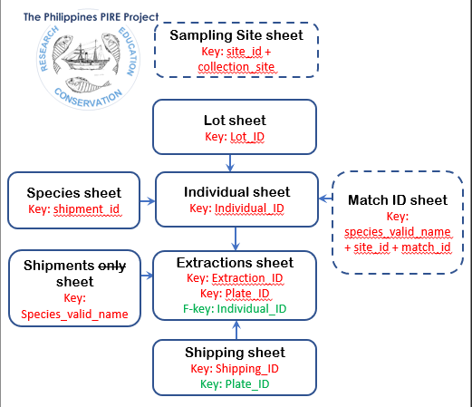

# 2017-2023 Philippines PIRE Database

This README explains the composition and purpose of the overall current directory, subdirectories (in bold), and files (in current directory)

The Philippines Pire Project (PPP) Database
The purpose of this directory is to organize all metadata in a suite of tidy sheets that can be connected allowing to track metadata across the databse.
Each sheet contains a single “Primary Key” (except for Extractions_sheet) in red that is used to unique identify each record in this sheet. Sheets may also contain “Foreign Keys” in green that is/are used as a link to other sheets where the current Foreign Key appears as the Primary Key. 
Please refer to the Database_diagramJan6.pdf for a schematic of the flow of sheets.

---

## Dirs

* `scripts` contains scripts to harness the database file

* `ouput` is where scripts outputs go

* `Biorepository_Database` John?

* `Extraction Plate layouts` This subdirectory contains files with “plate layouts” for specific extractions

---

## Files

* `Extractions and Database Workflow.docx` 
	Document showing the list and order of steps used during the extractions at ODU. This file has not been used in a while and likely not updated. 

* `Extractions_sheet.xlsx`
	This is the 4th sheet in the database (According to “Database_diagramJan6.pdf”) and should contain all the extraction records performed for PIRE. Each record is one extraction. Please note that in some occasions the same individual has been extracted more than once. In these cases, each extraction should have its own record. The Extraction_ID of the first extraction will end with “_Ex1”, the second with “_Ex2” and so on. The extraction_sheet is the only sheet that has two key columns, the “Extraction_ID” and “Plate_ID”. This sheet connects to the “Individual_sheet” via the “Individual_ID” and to the “Shipping_sheet” via the “Plate_ID”

* `Individual_sheet.xlsx`
